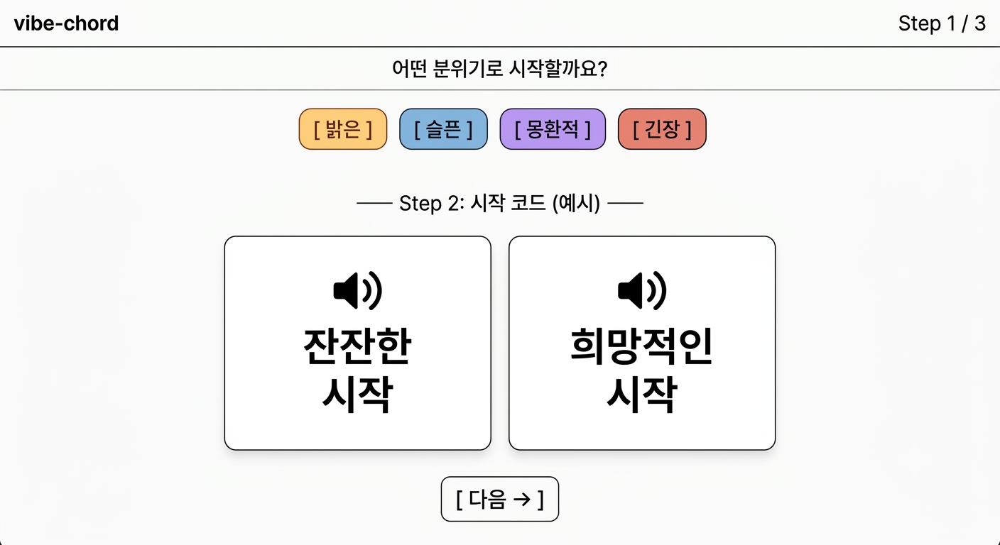
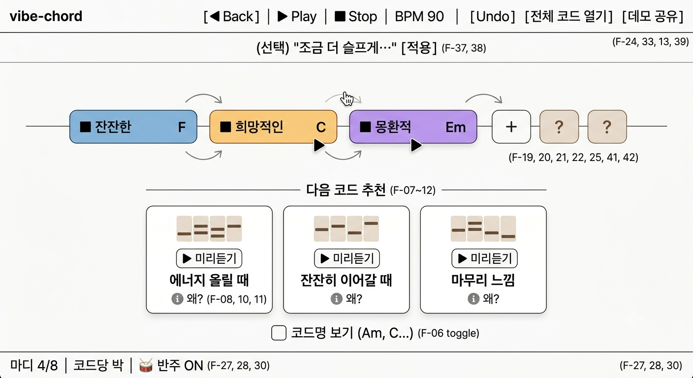
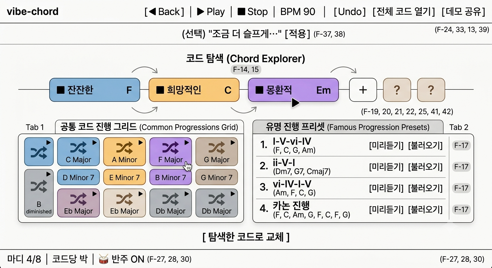
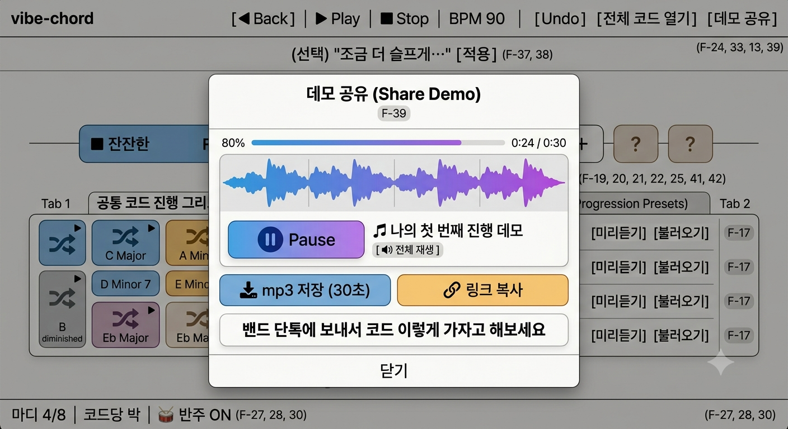

# Step 12. 스케치 및 결정

> 목적: 화면 설계안을 **각자 그려본 뒤** 팀이 맞추고, **최종 스케치만** 남긴다.

> **Guide:** (Step 01처럼 **대면 워크숍**으로 진행. Agent가 대신 채우지 않는다.)  
> 1. **각자** AI(v0, Bolt.new, Cursor 등)에게 `docs/10`·`docs/11`을 참고해 **페이지별 화면 스케치**를 그려본다.  
> 2. 팀이 스케치를 **공유**하고, 레이아웃·흐름·느낌을 **이야기**한다.  
> 3. 합의된 **최종 스케치**만 이 문서에 등록한다.  
> - 스케치 생성·비교는 각자·팀에서 한다. 이 문서에는 **결정 결과**만 적는다.  
> - v0·Bolt.new 등에 넘길 문장은 `docs/10`·`docs/11`을 참고해 각자 AI에게 요청하면 된다.  
> - 여러 후보 중 **팀이 고른 것**만 적는다. 개인 스케치 전부를 문서에 옮기지 않는다.

> **작성 메모:** 1인 스프린트 — `docs/assets/Gemini_Generated_Image_1~4.png`(최종 스케치) + **텍스트 와이어프레임**을 페이지 순서대로 병기 (온보딩 → 스튜디오 → 탐색 → 데모 공유).

## 최종 스케치

> 페이지별로 팀이 선택한 스케치. 링크·스크린샷 경로·한 줄 설명 중 편한 방식으로.

### 온보딩 — `/onboarding`

> **선택:** Gemini 스케치 — **3스텝 풀스크린 카드** (분위기 → 시작 코드 → 추천 미리 체험)  
> **링크·이미지:** `docs/assets/Gemini_Generated_Image_1.png`  
> **한 줄 요약:** 회원가입·용어 없이 **분위기 칩 + 큰 카드 탭 = 즉시 소리**만으로 첫 진행까지




**와이어프레임 (텍스트):**

```
┌─────────────────────────────────────┐
│  vibe-chord          Step 1 / 3     │
├─────────────────────────────────────┤
│  어떤 분위기로 시작할까요?            │
│                                     │
│  [ 밝은 ] [ 슬픈 ] [ 몽환적 ] [ 긴장 ] │  ← F-03 분위기 칩
│                                     │
│  ── Step 2: 시작 코드 (예시) ──      │
│  ┌──────────┐ ┌──────────┐          │
│  │ 🔊       │ │ 🔊       │          │  ← 탭 = F-01 즉시 재생
│  │ 잔잔한   │ │ 희망적인 │          │  ← F-05 한국어 라벨
│  │  시작    │ │  시작    │          │
│  └──────────┘ └──────────┘          │
│                                     │
│              [ 다음 → ]             │
└─────────────────────────────────────┘
```

### 작곡 스튜디오 — `/studio` (메인·데모 핵심)

> **선택:** Gemini 스케치 — **상단 Play · 가운데 타임라인 · 하단 추천 패널** 3단 레이아웃  
> **링크·이미지:** `docs/assets/Gemini_Generated_Image_2.png`  
> **한 줄 요약:** **듣고 고르는 놀이터** — 타임라인 블록 + 추천 카드(미리듣기·한 줄 안내)가 한 화면




**와이어프레임 (텍스트):**

```
┌─────────────────────────────────────────────────────────┐
│ ▶ Play  ■ Stop   BPM 90   [Undo]  [전체 코드 열기] [데모 공유] │  F-24,33,13,39
├─────────────────────────────────────────────────────────┤
│  (선택) "조금 더 슬프게…" [적용]                          │  F-37,38
├─────────────────────────────────────────────────────────┤
│  타임라인  ───────────────────────────────────────────   │  F-19,41,42
│  [■ 밝은][■ 잔잔][ + ][ ? ][ ? ]                         │  F-20,25 하이라이트
│       ↑ 드래그 순서 변경 · 블록 탭 = 즉시 재생 F-01,21,22 │
├─────────────────────────────────────────────────────────┤
│  다음 코드 추천                                         │  F-07~12
│  ┌────────────┐ ┌────────────┐ ┌────────────┐          │
│  │ ▶ 미리듣기 │ │ ▶ 미리듣기 │ │ ▶ 미리듣기 │          │  F-08
│  │ 에너지 올릴│ │ 잔잔히     │ │ 마무리     │          │  F-10
│  │   때       │ │  이어갈 때 │ │  느낌      │          │
│  │ ℹ️ 왜?     │ │ ℹ️ 왜?     │ │ ℹ️ 왜?     │          │  F-11
│  └────────────┘ └────────────┘ └────────────┘          │
│  [ ] 코드명 보기 (Am, C…)                    F-06 토글   │
├─────────────────────────────────────────────────────────┤
│  마디 4/8  │  코드당 박  │  🥁 반주 ON                   │  F-27,28,30
└─────────────────────────────────────────────────────────┘
```

### 코드·진행 탐색 — `/explore`

> **선택:** Gemini 스케치 — **공통 코드 그리드 + 유명 진행 프리셋** 2패널  
> **링크·이미지:** `docs/assets/Gemini_Generated_Image_3.png`  
> **한 줄 요약:** 추천 밖 **실험 공간** — 그리드 탭 = 즉시 듣기·추가, 프리셋 = 미리듣기·불러오기




**와이어프레임 (텍스트):**

```
┌─────────────────────────────────────┐
│  ← 스튜디오로          코드·진행 탐색 │
├─────────────────────────────────────┤
│  [ 전체 코드 ]  [ 유명 진행 ]        │  F-14~16
├─────────────────────────────────────┤
│  ●밝 ●밝 ○어두 ○밝 … (24 그리드)     │  F-14,15
│  ●밝 ○어두 ○밝 ●밝                   │  탭 = 재생+추가
│                                     │
│  또는 프리셋:                        │
│  · 4코드 팝 (I-V-vi-IV)    [불러오기] │  F-17
│  · 카논 진행               [불러오기] │
└─────────────────────────────────────┘
```

### 데모 공유 — `/share`

> **선택:** Gemini 스케치 — **데모 공유 모달** (미리듣기 + mp3·링크)  
> **링크·이미지:** `docs/assets/Gemini_Generated_Image_4.png`  
> **한 줄 요약:** 밴드 단톡용 **30초 데모** — 재생 확인 후 mp3·링크 공유




**와이어프레임 (텍스트):**

```
┌─────────────────────────────────────┐
│  ← 스튜디오              데모 공유   │
├─────────────────────────────────────┤
│  🎵 첫 코드 진행 (4마디)             │
│  [========▶========]  ▶ 다시 듣기   │
│                                     │
│  [ 📥 mp3 저장 (30초) ]             │  F-39
│  [ 🔗 링크 복사 ]                   │
│                                     │
│  "밴드 단톡에 보내서                 │
│   코드 이렇게 가자고 해보세요"        │
└─────────────────────────────────────┘
```

## 합의 사항

> 스케치 토론에서 팀이 맞춘 내용

- **디자인 방향:** **듣고 고르는 작곡 놀이터** — 어둡지 않은 **밝은 톤**, DAW처럼 복잡한 트랙 UI 금지. **카드·블록·칩** 중심, **Play가 항상 눈에 보임**.
- **공통 UI 규칙:**
  - **즉시 소리:** 모든 코드 선택 UI는 **▶ 또는 탭 = 0.3초 이내** 재생 (F-01)
  - **라벨:** 기본 **한국어 느낌** (F-05), 코드명은 **토글** (F-06)
  - **색:** 분위기별 블록 색 (밝=暖/슬=冷/몽환=紫) — 타임라인·그리드 **동일 색상 체계**
  - **버튼:** Primary = **▶ Play**, Secondary = 추천 카드·칩. **한 화면 Primary 1개**
  - **모바일:** 스튜디오 **추천 패널 = 하단 시트**, 타임라인 = **가로 스크롤** (F-32)
- **구현 시 유의:**
  - **데모 경로:** Step 11 **1→4→5→6→10→11→13** 단계가 **5분 데모** — 스튜디오 레이아웃 최우선
  - **온보딩**은 첫 방문만; `localStorage`로 **스킵** (Step 10 흐름 6)
  - **F-40(4마디 피드백)·F-37~38(자연어)** 는 Step 13 우선순위 후 **2차 UI**로 넣어도 됨
  - 스케치 이미지: `docs/assets/Gemini_Generated_Image_1.png` ~ `_4.png` (Step 12 최종)
